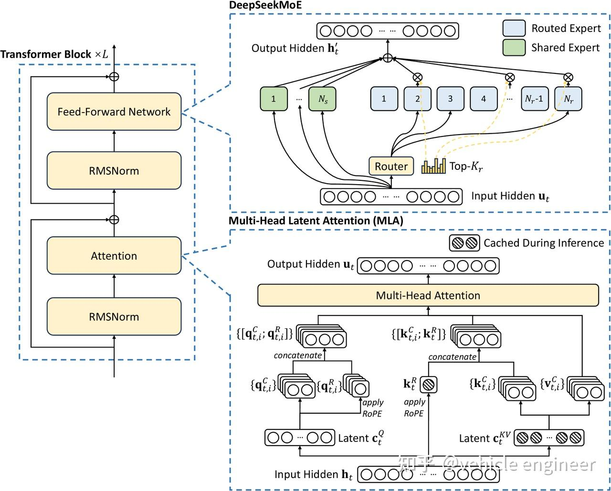
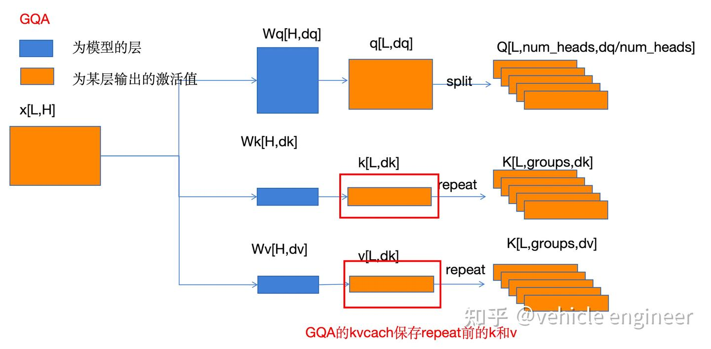
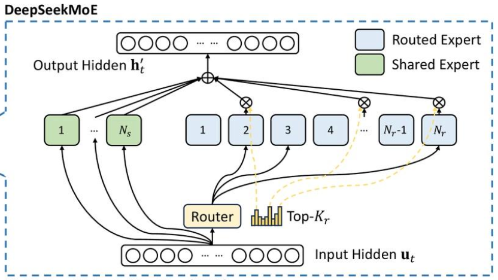

# Deepseek V3/R1

### Multi-Head Latent Attention（MLA）

MHA ➡️ GQA ➡️ MLA

- MHA：Q、K、V 分别有各自的 W，与 input 投影后再拆分 num_heads，最后拼接
- GQA：Q 独享，而 K、V 公用，num_heads = num_groups * N，每一个 group 内的 K、V 共享一个 W。KV cache 缓存下降 N 倍（一个 group 内有 N 个）
  - 缺点是同一 group 内的 K、V 相同，降低推理性能

- MLA：对 K、V 的权重矩阵，保存低秩矩阵从而降低显存占用量
  - 考虑 RoPE 时，将 c 向量后面一部分直接保留，没有再和 Wk、Wv 相乘，这一部分的 c 和 q 能够保留原始的 RoPE 特性。简单来说就是，最终计算 q 和 k 的注意力时，q 和 k 都有一半的维度保留了原始的注意力做法，从而保留了 RoPE 的位置编码特性

### Share MOE

- 专家头包括 **Share 专家** 和 **Router 专家**

- **Share 专家** 是一直激活的，即输入的 token 都会被 Share 专家头计算。

- **Router 专家头** 会先和上图中的 $u_t$ 计算亲和度（代码中直接用一个 Linear 层进行投影），选择 top-k 各专家进行推理（代码中推理计算 top-k 时，会先将 $N_r$ 个 Router 专家分组为 n_groups，将每个组中 top-2 各专家的亲和力加起来，算出亲和力最高的 top_k_group 个组，然后在这些组里选 top-k 个专家）
- 最终将所有的 Share 输出和 Router 专家进行亲和度加权相加，得到 MoE 层的输出

- 每个 token 都会触发一次 top-k

---

# OLMo 2